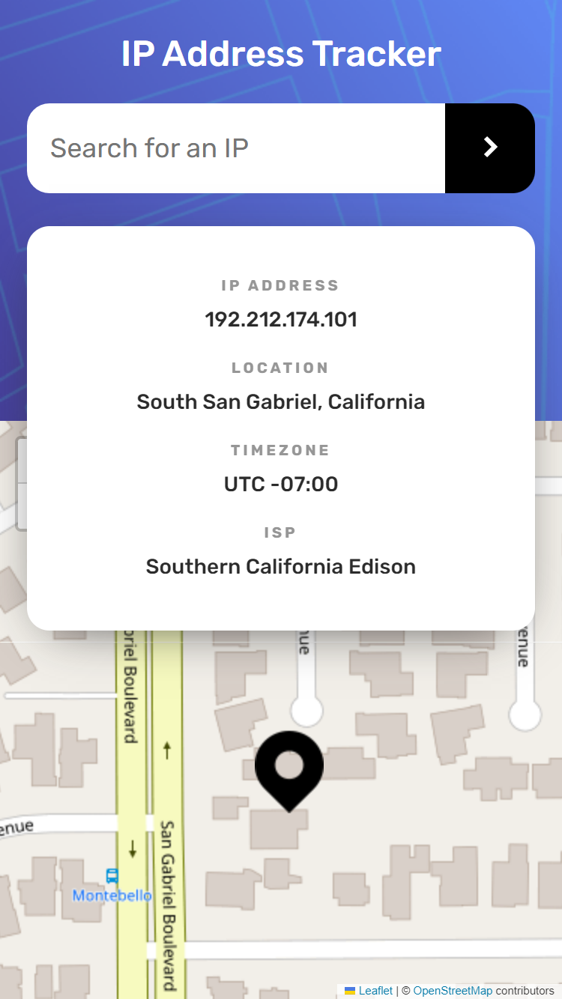
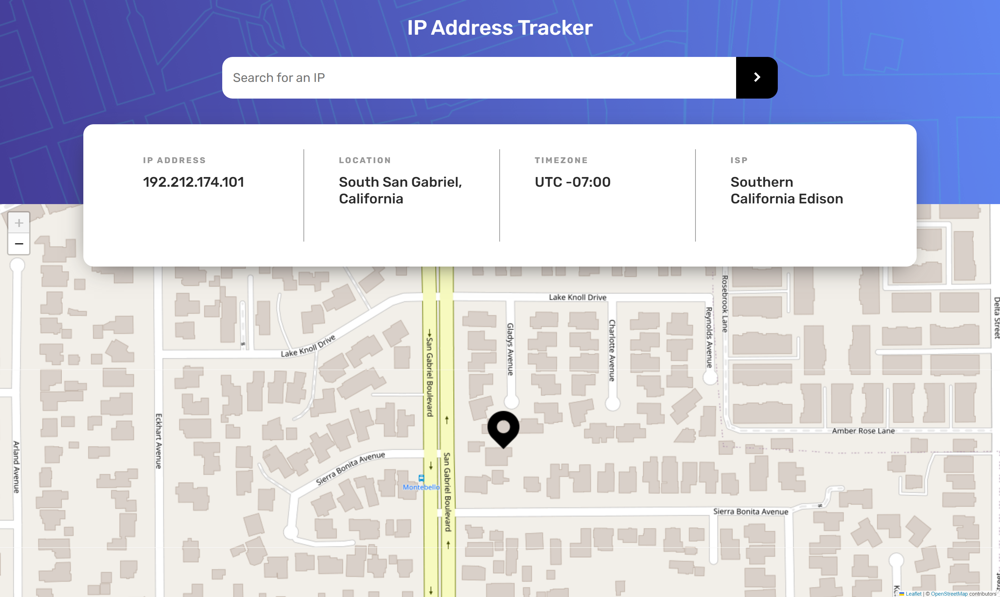

# Frontend Mentor - IP address tracker solution

Hello!

Firstly, I'd like to thank you for taking your time to review my project. This is a solution to the [IP address tracker challenge on Frontend Mentor](https://www.frontendmentor.io/challenges/ip-address-tracker-I8-0yYAH0).

## Table of contents

- [Overview](#overview)
  - [The challenge](#the-challenge)
  - [Screenshot](#screenshot)
  - [Built with](#built-with)

**Note: Delete this note and update the table of contents based on what sections you keep.**

## Overview

This application allow users to see their own API address on the map on the initial page load and search for any valid IP addresses and see their key information. The source directory is divided into following folders:
- assets folder - contains SCSS color variables file and images used inside the project
- components folder - contains two separate folders: layout (main layout components) and subcomponents (smaller components that are parts of main layout components)
- context folder - contains React Context which is responsible for handling communication with API
- models folder - contains often used interfaces

This project utilizes [IP Geolocation API](https://geo.ipify.org/) for searching IP addresses and [leaflet map](https://leafletjs.com/) for displaying an interactive map.

### The challenge

Users are able to:

- See loading animations while awaiting API's response.
- See their own IP address as soon as the application is mounted for the first time.
- Search for any valid IP addresses and see their detailed information.
- If the input value is not valid (it's empty or the IP address does not exist), users will receive an according error message.
- Address location is marked on the map using a custom icon.
- Map is centered automatically as soon as the IP address location changes.
- View the optimal layout for each page depending on their device's screen size.
- See hover states for all interactive elements on the page.

### Screenshot

Mobile view:

Desktop view:

### Built with

- React.js
- TypeScript
- SCSS
- BEM methodology
- Semantic HTML5 markup
- Mobile-first workflow

